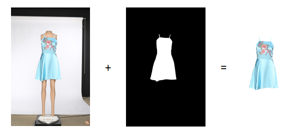

# Garment Segmentation
The intent of this project is to generate a garment cutout mask that can overlay the original mannequin dressed image thereby allowing an easy way to cutout the garment, illustrated below.

As a solution to our problem we will develop a deep neural network capable of predicting if a given pixel is background or garment. In a nutshell it is a binary classification problem per pixel. 

## Prerequisites/Requirements
* anaconda 3
* keras 2.0 w/ TF backend
* sklearn
* skimage
* matplotlib
* tqdm
* glob
* copy
* h5py
* opencv for python

## Thanks to:
This solution was inspired and partly based on [Heng CherKeng's code for PyTorch](https://www.kaggle.com/c/carvana-image-masking-challenge/discussion/37208) and [Peter Giannakopoulos Kaggle-Carvana-Image-Masking-Challenge](https://github.com/petrosgk/Kaggle-Carvana-Image-Masking-Challenge) . I kindly thank them both for sharing their work.

## Usage

### Structure and content

#### Input data
The input data is located in the input folder and contains two datasets:
* demonstration_set which contains 6 garments in three view points. This is intended for experimentation with provided scripts
* images_front_200 which can be used for training etc.
Both folders contain the raw images in 'original folder', the photoshop created cutouts in the 'cutout folder' and finally the the masks coming from the cutouts in the 'mask folder'

#### Model folder
Contains the functionality of the ML NN model plus loss function, Dice implementation and cyclic learning rate functions.

#### Normalization folder
Contains the matrixes needed for centering and normalizing our input data.

#### Notebooks folder
Contains a number of notebooks that has been used in various experiments. The three main notebooks are located directly in the folder itself and are for:
* garment_segmentation_preprocessing: our preprocessing steps
* unet_models: NN models used
* final_unet_no_mask_1024_meanstd_resize_optimized: our final optimized solution

#### Results folder
Demonstrates in the subfolder 'final_model_results' the outcome of our best solution applied to certain images. Also contains csv files documenting performance achieved during certain experiments

#### Util folder
Contains utility scripts in form of:
* params: our global config file
* cutouts_to_masks: extracts the alpha mask from the cutout
* remove_background: minimises the effect of noisy background from the original garment image
* image_augmentation: various augmentation functions

#### Weights folder
Location of where our solution will be looking for the weight files. Note: they will need to be downloaded separately from Dropbox.

#### Root folder
Contains three groups of files:
* Udacity reports in form of capstone_proposal.pdf and capstone_report.pdf
* Single and double predictor implementations (predict_single_pass and predict_double_pass)
* Scripts to illustrate various metrics and performance of solution:
  
  - calc_metrics_and_visualize: utility script for calculating Dice scores for data set and visualizing the performance of the predicted masks
  - show_garment_results: showing original image next to our prediction mask followed by DCIL/ISI cut-out mask and finally the effect of applying our mask to the original image
  - show_preprocessing_techniques: illustrates the effect of histogram equalization and contrast stretching techniques on gray and color images 

### Downloading the Pre-trained Weights
You need to download the pre-trained weights as these are to big for github (135 MB) so have added them to Dropbox.

For use with Single pass predictor (no focus mask):
<https://www.dropbox.com/s/xunie677mm6n9q1/unet_no_focus_mask_1024_meanstd_resize_optimized.hdf5?dl=0>

For use with Double pass predictor (with focus mask):
<https://www.dropbox.com/s/dc21j5mxwcfwnx6/unet_with_focus_mask_1024_not_optimized.hdf5?dl=0>

Should be placed in the weights folder.

### Training the Model
To train the model it is recommended to grab the Jupyter notebook 'final_unet_no_mask_1024_meanstd_resize_optimized.ipynb' and update paths to input files, to output files such as weight and normalization files. Obviously this also applies to any experimentation. 

### Getting the predictions
To get the predictions of a trained model. First ensure that appropriate weight file has been downloaded and placed in weight folder (if renamed update params file). 
To run predictor just execute predict_single_pass or predict_double_pass against appropriate imagery.

NOTE: all scripts should work out of the box as they are configured to run against the demonstration_set.

