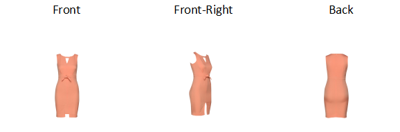
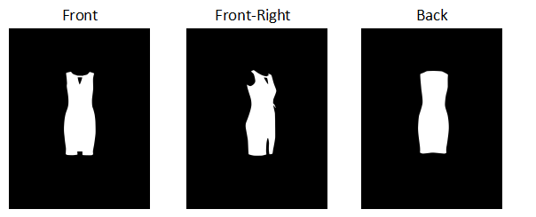

# Machine Learning Engineer Nanodegree
## Capstone Project: Garment Segmentation
John Larsen  
April 7th, 2018

## I. Definition

### Project Overview

The motivation for this project is rooted in my current work at Metail.com where we provide smart technology for fashion imagery. Meaning, shoot images without the need to hire models, photographers or hair and make up artists.

#### How it works:
A garment collection is styled and shoot on mannequins, then our technology dresses the model (pre-shoot), of the customers choice, in the clothing as if he/she was photographed wearing it.

Actually our models and garments will be shoot at different viewpoints using our own custom rotating photo studio, that automatically captures and processes 3 standard images of each garment (and model). Namely Front, Front-Right and Back. 
Image viewpoints: 

The steps involved in creating the catalogue images are:
* Photograph the garment on a mannequin in each of the 3 viewpoints
* Cutout garment for each image and save separately
* Warp cutout garment into position for each viewpoint and each pose on a selected model
* Apply shade (garment/body and vice versa) for each viewpoint and each pose on a selected model
* Change background

> NOTE: above assumes the model is already in the system, if that is not the case then the model will be invited into the photo studio and placed on the turntable. Once on the turntable the model will be photographed in the 3 viewpoints for each pose selected.

 

Simple. Fast. Efficient.

Well, is is actually not fast and efficient. A larger team based in India is cutting out the garment using Photoshop, then warping the cutout garment to a selected pose and finally shades are applied. Around 14% of the time in generating the final catalogue imagery is based around garment cutouts. We are determined to bring down the time it takes in order to reduce costs and lower turn around time.

What I would like to investigate is how deep learning may help us achieve those goals. In other words using CNN's to generate good quality image masks that our Indian team can use in order to speed-up the cutout stage.

The dataset being used is generated from our past experience of digitizing roughly +10K garments. This is our own data generated from shooting in our own photo studios over the years. The dataset itself consists of two types of images:
* The image shoot on the dressed mannequin
* The Photoshop generated cutout

### Problem Statement

To generate a garment cutout mask that can overlay the original mannequin dressed image thereby allowing an easy way to cutout the garment, see illustration below.

How it works: 

In order to measure the performance and success of the neural work I will use the Dice coefficient (also know as F1 score) as it is a well known metrics to  use for measuring the performance of segmentation work. It literally measures the (Area of Overlap / Area of Union) between two datasets. The two datasets in question here being the manual cutout mask and the NN predicted garment mask.

#### The Approach
As a solution to our problem we will develop a deep neural network capable of predicting if a given pixel is background or garment. In a nutshell it is a binary classification problem per pixel. Tasks to perform:
* The data (images) are well understood and coming from our own controlled environment. So all that needs doing is to generate the required tensors for training and validating the imagery with a little preprocessing.
* Next we will build a simple model in Keras to run the training data against. Based on the lessons learned from the model we will we will move onto a U-net implementation. Initially keeping it small, 256x256 model, before moving to higher resolution like 1024x1024 model.
* With the U-net model in place the next phase is to evaluate on how:
  * Learning rate affects results, while having a look at cyclical learning rates
  * Optimization algorithms (Adam, RMSProp..) affects results

* The dataset used is reasonably limited in size and that leads us naturally into image augmentation. Resulting in a larger dataset and allowing the model to generalize better.

* Lastly, looking at the raw imagery from the studios it is clear that there are some noise in the images from turntable, wires, background sheets and walls etc. We will consider techniques to reduce the noisy background.

### Metrics

The Dice coefficient (F1 score) is the main metrics for measuring the performance of the segmentation work. Reason for selecting this coefficient is that it is a well known and industry accepted metric for measuring the performance of segmentation work. As such it also provides us with a metric to compare against our benchmarks at the end of this section. 

      Dice coefficient = 2 * |X ∩ Y| / (|X|+|Y|) = 2TP / (2TP + FP + FN)

where |X| and |Y| are the numbers of elements in the two samples. The Dice coefficient is the quotient of similarity and ranges between 0 and 1. 1 being perfect overlap and 0 no overlap at all. It can be viewed as a similarity measure over sets (Area of Overlap / Area of Union). The two sets here being the manual alpha cutout mask and the NN predicted garment mask. 

I will compile the Keras model to use the following metrics: 'dice coefficient' & 'accuracy' and likewise the loss function will also have the Dice coefficient built into it together with categorical cross-entropy.

    Loss function = weightBCE * binaryCrossEntropy(y_true, y_pred) -
                    weightDice * diceCoeff(y_true, y_pred)

#### Benchmark Models
I have two different benchmarks that I will compare the solution against:

* The first one is a trial done by our R&D team where they used similar imagery and a DeepLab-LargeFOV upsample model, exploiting atrous (dilated) convolutions to increase the field-of-view. Resulting in a Dice score of 98.32% on 2644 images. 
* The second one is the earlier mentioned 'Carvana Image Masking Challenge'. Not exactly the same domain but conceptually a very similar problem. I would argue however that garments are more challenging than cars due to various fabrics, translucent materials, lace, fur etc. Nevertheless I hope to match scores as seen in the Carvana challenge where the winner demonstrated a Dice score around 99.7%

My hope and aim is to obtain a Dice score > 98.32% and close to 99.7%.

## II. Analysis

### Data Exploration & Visualization

The data being used is a smaller subset from our own photo studios over the years. The dataset itself consists of two types of images:
* The image shoot on the dressed mannequin
* The Photoshop generated cutout

The segmentation dataset used here consists of 1084 raw garment images and an equivalent number of cutouts (masks). The resolution of the imagery is 1152x1728, the type is Portable Network Graphics (PNG) thereby using format: RGBA (byte-order). The combined size of the imagery is 1.1 GB.

The cutouts are created by our Indian team using Photoshop on the images shoot on the dressed mannequin. These cutouts are our ground truth and illustrated here:

However we will only use the cutouts indirectly as we won't train and validate against the cutout itself but rather against the alpha-mask contained in the cutout image:

Summary of image data:
<table id="t01">
  <tr>
    <th>All images</th>
    <th>Garments</th> 
    <th>Cutouts</th>
    <th>Front</th>
    <th>FrontRight</th>
    <th>Back</th>
  </tr>
  <tr>
    <td>2168</td>
    <td>1084</td> 
    <td>1084</td>
    <td>724</td>
    <td>720</td>
    <td>724</td>
  </tr>
</table>
    

#### Challenges with current imagery

Our segmentation data available originates from a different product called the ME model experience. Unfortunately one of the problems with this data is, it currently can't handle showing the inside back-layer of a garment if visible. As a result cutouts don't show the inside back-layer at all as illustrated here:

Inaccurate cutouts: 

Yes, earlier images of the first dress has been manually modified to contain the back-layer for the cutout and the mask. In reality the inside back-layers are not present in cutouts or masks. This will be a challenge for not least dip hem dresses (longer at the back than the front). The impact will be a slight reduction of the accuracy we can expect for the dataset.

### Algorithms and Techniques

The data (images) are well understood and coming from our own controlled environment. So all that needs doing is to generate the required tensors for training and validating the imagery, including some preprocessing.
 
Next we will build a simple model in Keras to run the training data against. We will use a U-Net neural network (CNN) architecture which will learn how to automatically create the masks:

* By feeding into the neural net the images of the garments
* By using a loss function comparing the output of the neural net with the appropriate masks and back-propagating the error for the network to learn

The output of the network will be a probability map where each entry, read pixel, expresses its probability of being part of the garment. To get to the binary black and white cutout mask we introduces a threshold. Any pixel value equal to or beyond the threshold is deemed garment and the rest is background. It is worth having another look at the Dice Coefficient again:

    Dice coefficient = 2 * |X ∩ Y| / (|X|+|Y|) = 2TP / (2TP + FP + FN)

Basically the higher the threshold the fewer false positives (FP) but unfortunately at the expense of more false negatives (FN) - so it is a careful balance in the pursuit of maximizing the Dice Coefficient.

As loss function we will use our own custom loss function utilizing the Dice Coefficient. Additionally weighting the Dice score higher than the binary-crossentropy (BCE):

    Loss = 1/2 * BCE(ground-truth, prediction) - 2 * dice-coeff(ground-truth, prediction)

With the U-net model in place the next phase is to optimize the parameters of the model:
* Classification threshold ​(as above)
* Training parameters
  * Training length (number of epochs)
  * Optimization algorithms (what algorithm to use for learning)
  * Learning rate (how fast to learn; this can be dynamic)
* Neural network architecture
  * Number of layers
  * Layer types (convolution, fully-connected, batch or pooling)
  * Connections between layers

The dataset used is reasonably limited in size and that leads us naturally into image augmentation in form of translational invariance, zoom, coloration and intensity. Resulting in a larger dataset, more training data, but also allowing the model to generalize better (reducing over-fitting).

Lastly, looking at the raw imagery from the studios it is clear that there are some noise in the images from turntable, wires, background sheets and walls etc. What if we initially train a model to predict the garment in the original image, that is, calculate the garment mask and then use this garment mask, by dilating it, to cutout a new image with very little noisy background in it. This second stage image then feeds into a second model (same architectural model) but that has been trained on these 'dilated mask' images, illustrated below. Is that going to give us anything extra?

During training, both the training and the validation sets are loaded into the RAM. After that a few images are selected to be loaded into the GPU memory for processing at a time, our batch-size. Due to K80 GPU memory limitations of 12 GB RAM we can only get away with a small batch size when running with higher resolution images like 1024x1024 and a decent model. The training is done using various optimization algorithms, learning rates and slight variations in the neural network architecture. In contrast to this, inference is done using only the CPU.

### Benchmark
We have already discussed our benchmarks and stated that we aim to reach a Dice score > 98.32% and as close to 99.7% as possible.

## III. Methodology

### Data Preprocessing
The preprocessing performed is illustrated in the separate preprocessing notebook garment_segmentation_preprocessing.ipynb and consists of the following steps:
1. Turning the cutouts into proper binary segmentation masks by extracting the Alpha channel from the RGBA input
2. Split the original garment image set into training and validation sets and with the equivalent split on the mask dataset 
3. Load original garment images in color mode and masks in gray scale mode. Actually we will also run an experiment to check if one mode is preferred over the other on the original garment images
4. Resize images into smaller sizes as the GPU can't handle our original image size with a performant deep learning model
5. Turning the image array into a format that Keras can work with, that is, turn the [0, 255] array into a floating point array in the range [0, 1]
6. Normalizing image inputs by subtracting the mean from each pixel, and then dividing the result by the standard deviation. The distribution of such data would resemble a Gaussian curve centered at zero, that is, ensure that each input parameter (pixel, in this case) has a similar data distribution. We will analyze the results both with and without centering and normalizing of the image data
7. Finally a few computer vision algorithms are tried for enhancing contrast with the hope of faster convergence and/or accuracy:
    - Contrast stretching
    - Histogram equalization

Note: it is worth pointing out that all our data has the same resolution, namely 1152x1728. In other words all images have the same size and aspect ratio and does not require any further action.

### Implementation
#### Introducing the U-Net model
The U-Net paper (https://arxiv.org/abs/1505.04597) present itself as a way to do image segmentation for biomedical data. It turns out you can use it for various image segmentation problems such as the one we will work on. In our case, using a U-Net is a good choice because of the lack of training data. This neural network architecture has revealed to be very good in this situation. U-Nets have an ability to learn in environments of low to medium quantities of training data, and the amount of training data available to us is considered low.

A U-Net is like a convolutional autoencoder, but it also has skip-like connections with the feature maps located before the bottleneck layer, in such a way that in the decoder part some information comes from previous layers, bypassing the compressive bottleneck.

The figure below, taken from the official paper of the U-Net, illustrates why it is called a U-Net model:

Thus, in the decoder, data is not only recovered from a compression, but is also concatenated with the information’s state before it is passed into the compression bottleneck so as to augment context for the next decoding layers to come. That way, the neural networks still learns to generalize in the compressed latent representation (located at the bottom of the “U” shape in the figure), but also recovers its latent generalizations to a spatial representation with the proper per-pixel semantic alignment in the right part of the U of the U-Net.

The implementation is done in a separate implementation notebook, find it here unet_models.ipynb, and consists of the following high level steps:
* Develop simplest possible model and show it can learn
* Develop basic model with high entropic capacity and demonstrate its performance
* Introduce the final model that will subsequently undergo fine tuning and refinement

#### About the simplest possible U-Net model:

*Encoding:*

- it will receive as input a color image with a resolution of 256x256, input: 256x256x3
- it will have only one layer for encoding in form of a block consisting of:
   - 2D convolution consisting of 32 filters, a (3, 3) kernel, default strides of (1, 1), padding is same, meaning, output size is the same as input size, requires the filter window to slip outside input map, hence the need to pad
  - a batch normalisation to handle covariance shift and helps the model converge faster, more on this later
  - the traditional activation function of ReLU
- next down-sampling the input via max polling (256x256 --> 128x128). Done to help over-fitting by providing an abstracted form of the representation, as well as, reduce the computational cost by reducing the number of parameters to learn

*Bottleneck:*

- follow the same principle as described above for the first block. The only difference is that here we generate 128 filters, that is, increases the depth of our feature map stack to 128

*Decoder:*

- upsampling of the feature map followed by a 2x2 convolution (“up-convolution”, 128x128 --> 256x256)
- concatenation with the correspondingly cropped feature map from the contracting path. The cropping is necessary due to the loss of border pixels in every convolution
- next followes our normal convolutional block

*Classification:*

- the final layer a 1x1 convolution is used to map each 32-component feature vector to one class, namely a garment class. In other words it is the probability per pixel of being garment or not.

The model is visualized here and the code demonstrated below.

    def simple_unet_256_segmentation_model(input_shape=(256, 256, 3), num_classes=1):
        inputs = Input(shape=input_shape) # 256
    
        down = Conv2D(32, (3, 3), padding='same')(inputs)
        down = BatchNormalization()(down)
        down = Activation('relu')(down)
        down_pool = MaxPooling2D((2, 2), strides=(2, 2))(down) #128
    
        center = Conv2D(128, (3, 3), padding='same')(down_pool)
        center = BatchNormalization()(center)
        center = Activation('relu')(center) # center
    
        up = UpSampling2D((2, 2))(center)
        up = concatenate([down, up], axis=3)
        up = Conv2D(32, (3, 3), padding='same')(up)
        up = BatchNormalization()(up)
        up = Activation('relu')(up) # 256
    
        classify = Conv2D(num_classes, (1, 1), activation='sigmoid')(up)
    
        model = Model(inputs=inputs, outputs=classify)
    
        return model

#### Introducing our own loss funtions

The Dice coefficient (F1 score) is the main metrics for measuring the performance of the segmentation work (together with the IoU: intersection over Union).

As we are aiming for a perfect overlap, dice coefficient of 1, why not build it into the loss function itself as illustrated in below code where we weigh the Dice coefficient 4 times above the BCE. We add BCE to the loss function as it is a binary problem in form of garment versus background. 

    def dice_coeff(y_true, y_pred):
        smooth = 1
        y_true_f = K.flatten(y_true)
        y_pred_f = K.flatten(y_pred)
        intersection = K.sum(y_true_f * y_pred_f)
        return (2. * intersection + smooth) / (K.sum(y_true_f) + 
                K.sum(y_pred_f) + smooth)
    
    
    def bce_dice_loss(y_true, y_pred):
        loss = 0.5 * binary_crossentropy(y_true, y_pred) - 
                2*dice_coeff(y_true, y_pred)
        return loss

#### Compiling our model
Next we ask the model to use RMSprop as optimizer with fixed learning rate of 3e-4. We tell the model to use our own loss function we just discussed and finally we select the metrics to use as the Dice coefficient along with pixel accuracy.

    model.compile(optimizer=RMSprop(lr=0.0003), loss=bce_dice_loss, 
                  metrics=[dice_coeff, 'accuracy'])

#### Training our model
Finally we are ready to train out simple model. We train it my calling the fit method of the Keras Model. It it supplied with the four tensors (2 x training, 2 x validation) and a higher batch size which should help speed up convergence of the model. Additionally I have supplied three callback functions:

* EarlyStopping as no reason to continue training a model that is not improving. Have set a patience to 20, meaning, that if after 20 epochs the model has not improved its metric by at least min_delta=1e-4 then stop training any further
* ModelCheckpoint to save the weights that brought about an improvement in our metric, here validation loss
* TensorBoard to safe a log that can subsequently be analyzed for metric improvements against epochs etc

      callbacks = [EarlyStopping(monitor='val_loss', patience=20, verbose=2, 
                                  min_delta=1e-4),
                   ModelCheckpoint(monitor='val_loss', filepath='./weights/ +
                                    str(weight_file_name) + '.hdf5',
                                    save_best_only=True, save_weights_only=True),
                   TensorBoard(log_dir='./logs')]
      
      
      history = model.fit(orig_train_tensors, seg_train_tensors, batch_size=batch_size, 
                          epochs=epochs, verbose=1, 
                          validation_data=(orig_valid_tensors, seg_valid_tensors), 
                          callbacks=callbacks)

#### Result
This model works however it is not sufficiently complex that it can capture all the features in the garments. The performance of this model is illustrated in below table and figures showing various metrics plotted against epochs. Further discussion of results are postponed to the **Final Results** section.

<table id="t01">
  <tr>
    <th>Train Loss</th>
    <th>Train Acc.</th> 
    <th>Train Dice</th>
    <th>Valid Loss</th>
    <th>Valid Acc.</th>
    <th>Valid Dice</th>
  </tr>
  <tr>
    <td>-1.4932 &darr; </td>
    <td>0.9693 &uarr; </td> 
    <td>0.7761 &uarr; </td>
    <td>-1.4023</td>
    <td>0.9611</td>
    <td>0.7373</td>
  </tr>
</table>

Note: arrows indicates that the model starts overfitting in terms of constantly improving on the training data but can't generalize to validation data.   

The simple model was not sufficiently complex that it could capture all the features in the garments. So to that effect we introduce the basic U-Net model.

#### The basic U-Net model:

This model is identical compared to the simple model in that it contains the same structure and the same elements. Only difference, it has many more layers and much bigger feature map sizes (much higher entropic capacity). In this 5 block-layer model we half the 2-D dimensions of the feature maps per layer but increase the amount of filters per layer by a factor of 2 or 4:

*Encoder (per block-layer, 4 in total, (256x256x3 --> 16x16x1024)):*
- Convolutional block (Con2D --> BN --> Activation)
- Max polling (1/2 the size (dimension) of the feature maps)

*Bottlenect (16x16x2048):*
- The same just many more filters

*Decoder (per layer, 4 in total, (16x16x2048 --> 256x256x32)):*
- upsampling of the feature map
- concatenation
- convolutional block (as before just many more filters)

All of this resulting in 61,963,281 trainable parameters - we have entropic capacity now. In terms of getting to a trainable result everything is kept like in the simple model case. For details see unet_models.ipynb.

#### Result
This model works really well. The performance of this model is illustrated below. Further discussion of results are postponed to the **Final Results** section.

<table id="t01">
  <tr>
    <th>Train Loss</th>
    <th>Train Acc.</th> 
    <th>Train Dice</th>
    <th>Valid Loss</th>
    <th>Valid Acc.</th>
    <th>Valid Dice</th>
  </tr>
  <tr>
    <td>-1.9826</td>
    <td>0.9976</td> 
    <td>0.9924</td>
    <td>-1.9586</td>
    <td>0.9960</td>
    <td>0.9826</td>
  </tr>
</table>

With this model we see a big improvement however we can do even better so I introduce our final model.

#### The final U-Net model:

The final model, that's the model we will use going forwards, comes from Heng CherKeng's constribution to the Kaggle Carvana Image Masking Challenge. His code was based on PyTorch but a Keras implementation was made available by Peter Giannakopoulos here: <https://github.com/petrosgk/Kaggle-Carvana-Image-Masking-Challenge>.
No reason to reinvent the wheel so we gratefully thank both of them for sharing their work. 

This model is very similar to our basic model. There are no new features we haven't already discussed. In this 6 block-layer model 2-D dimensions of the feature maps are consistently halved per block/layer while the number of filters are doubled. The main difference lies within a block/layer where they use double and triple convolution blocks versus our single convolution block:

*Encoder (per layer, 5 in total, (256x256x3 --> 8x8x512)):*
- 2 x Convolutional block (Con2D --> BN --> activation)
- Max polling (1/2 the size of the feature maps)

*Bottleneck (8x8x1024):*
- 2 x Convolutional block (Con2D --> BN --> activation) with more filters

*Decoder (per layer, 5 in total, (16x16x1024 --> 256x256x32)):*
- Upsampling and concatenation as before
- 3 x Convolutional block (Con2D --> BN --> activation)- 

#### Result
This model works really really well. The performance of this model is illustrated below. Further discussion of results are postponed to the **Final Results** section.

<table>
  <tr>
    <th>Train Loss</th>
    <th>Train Acc.</th> 
    <th>Train Dice</th>
    <th>Valid Loss</th>
    <th>Valid Acc.</th>
    <th>Valid Dice</th>
  </tr>
  <tr>
    <td>-1.9872</td>
    <td>0.9978</td> 
    <td>0.9945</td>
    <td>-1.9706</td>
    <td>0.9967</td>
    <td>0.9882</td>
  </tr>
</table>

The model converges nicely and very fast and again with much less variation than earlier. This model is performing very well on our data, the extra layers and the extra convolutions have paid off!

### Refinement

With the well performing U-net model in place the next phase is to optimize the parameters of the model. We will touch on the following areas:
* Preprocessing steps
* Training parameters
  * Learning rate (how fast to learn; this can be dynamic)
  * Optimization algorithms (what algorithm to use for learning)
* Image augmentation (invariance, zoom, coloration and intensity)
* Minimizing noisy background 

We will discuss the effect of varying the classification threshold in the result section.

#### Preprocessing steps
Please note I will not go into great details regarding preprocessing as already mentioned in the **Data Preprocessing** section and described in detail in the garment_segmentation_preprocessing notebook.

#### Preprocessing results
The following results are based on our 1084 samples trained at a resolution of 256 using our final model. Please note that the validation Dice is as reported from training the model however **all** other values are a result of running the predictor of that trained model against the full dataset using the original image resolution 1152 x 1728. 
**The Mean and Median Dice's reported can not be read as absolute values**, most images where part of the training data, but they can be compared relative to each other. The various training notebooks and the associated validation Dice scores can be found here: notebooks/preprocessing/unet_no_mask_256_preprocessing_XXX.

<table>
  <tr>
    <th>Preprocessing Method</th>
    <th>Mean Valid Dice</th>
    <th>Mean Dice</th> 
    <th>Median Dice</th>
    <th>Outlier Corrected Mean Dice</th>
    <th>Outlier Corrected Median Dice</th>
    <th>Outliers removed</th>
  </tr>
  <tr>
    <td>Centeret & Normalised Color</td>
    <td>0.9882</td> 
    <td>0.9907</td>
    <td>0.9921</td>
    <td>0.9917</td>
    <td>0.9922</td>
    <td>15</td>
  </tr>
  <tr>
    <td>Baseline Color</td>
    <td>0.9877</td> 
    <td>0.9898</td>
    <td>0.9915</td>
    <td>0.9907</td>
    <td>0.9916</td>
    <td>7</td>
  </tr>
  <tr>
    <td>Contrast Strech Color (p2p98)</td>
    <td>0.9868</td> 
    <td>0.9896</td>
    <td>0.9915</td>
    <td>0.9907</td>
    <td>0.9915</td>
    <td>8</td>
  </tr>
  <tr>
    <td>Histogram Equalization Color</td>
    <td>0.9861</td> 
    <td>0.9900</td>
    <td>0.9920</td>
    <td>0.9912</td>
    <td>0.9921</td>
    <td>5</td>
  </tr>
  <tr>
    <td>Contrast Strech Color (p10p90)</td>
    <td>0.9855</td> 
    <td>0.9902</td>
    <td>0.9919</td>
    <td>0.9912</td>
    <td>0.9920</td>
    <td>9</td>
  </tr>
  <tr>
    <td>Resize Optimized Color</td>
    <td>0.9845</td> 
    <td>0.9916</td>
    <td>0.9928</td>
    <td>0.9923</td>
    <td>0.9929</td>
    <td>6</td>
  </tr>
  <tr>
    <td>Baseline Gray</td>
    <td>0.9845</td> 
    <td>0.9892</td>
    <td>0.9914</td>
    <td>0.9905</td>
    <td>0.9915</td>
    <td>6</td>
  </tr>
  <tr>
    <td>Contrast Strech Gray (p2p98)</td>
    <td>0.9824</td> 
    <td>0.9891</td>
    <td>0.9915</td>
    <td>0.9906</td>
    <td>0.9916</td>
    <td>7</td>
  </tr>
  <tr>
    <td>Histogram Equalization Gray</td>
    <td>0.9796</td> 
    <td>0.9880</td>
    <td>0.9910</td>
    <td>0.9898</td>
    <td>0.9911</td>
    <td>5</td>
  </tr>
</table>

First observation from this test clearly shows that for best performance color is the way to go. The more information contained in the 3 color channels is being used and as a result the model performs much better that just 1 gray channel, roughly 3 to 4 tens of a percent better.

Second observation, when resizing imagery always apply apropriate interpolation-algorithms:
- Downsize: cv2.resize(img, (input_size, input_size), interpolation=cv2.INTER_AREA)
- Upsize: cv2.resize(img, (orig_width, orig_height), interpolation=cv2.INTER_CUBIC)

Interpolation-algorithms are easy to apply and have one of the largest impacts on improving our performance. Using these algorithms should be consistent, meaning, apply when preparing the data for training but also when applying the predictor.

Third observation is that centering and normalizing the data has a big positive effect and should be done despite relying heavily on batch normalization.

Fourth observation is that contrast enhancing techniques are interesting and have potential but for our professional operated and equipped photo studios we don't really see any benefits. Considering also the added complexity to the solution it is not worth pursuing contrast enhancing techniques any further for our datasets. 

#### Learning rate
So far we have used a fixed learning rate of 3e-4. The truth is that this value has already been optimized by performing many trial runs and experiments. However what we can do is make it dynamic (further details here <https://github.com/bckenstler/CLR> and here <http://ruder.io/deep-learning-optimization-2017/index.html#tuningthelearningrate>). So to this effect we introduce a declining cyclic learning rate (contained in model/cyclic_learning_rate.py). The idea being that 1) once you have a good learning rate then gradually reducing it often improves the learning itself 2) cyclic learning rates increases the likelihood of not getting stuck in local minimum but rather finding a better 'global' minimum 3) increasing the learning rate is an effective way of escaping saddle points:

    def plateau_then_decl_triangular_lr(epochs):    
        """
            Given the inputs, calculates the lr that should be applicable for this epoch. 
            The algo will start out with a LR equal to the average of the min and max 
            rates for the first no. of plateau_steps. Hereafter the algo will start 
            oscillating with a wave length at 2 x step_size and an ever declining 
            amplitude (the minimal LR is unaffected however the max LR will keep 
            declining in an power based fashion) 
        """
        
        if epochs < plateau_steps:
            return (min_lr + max_lr)/2
        
        cycle = np.floor(1+epochs/(2*step_size))
        x = np.abs(epochs/step_size - 2*cycle + 1)
        lr = min_lr + (max_lr - min_lr) * np.maximum(0, (1-x))/float(1.2**(cycle-1))
        return lr

Illustrated here with the following input:
plateau_steps = 2, step_size = 10, min_lr = 5e-5, max_lr = 5e-4

#### Learning rate results
The CLR helped out initially to make the model converge faster and identify the range where the LR was most efficient however once I used that information with a fixed LR of 3e-4 I was not able to improve the performance any further using the CLR. Best Dice coefficients with fixed and variable LR in below table:
<table>
  <tr>
    <th>Fixed LR of 3e-4</th>
    <th>Our Variable LR in range 5e-5 to 5e-4</th> 
  </tr>
  <tr>
    <td>0.9882</td>
    <td>0.9875</td>
  </tr>
</table>

#### Optimization algorithms
Next we look at how various gradient descent optimization algorithms performs with our model and the given data. Specifically I have compared Adadelta, Adam, RMSProp and SGD. Please note that these results where obtained with 1024x1024 and the data have not been centered or normalized. In Keras this is as easy as just changing the optimizer function that we compile our model with:

    sgd = SGD(lr=1e-5, decay=2e-6, momentum=0.9, nesterov=False)
    model.compile(optimizer=sgd, loss=bce_dice_loss, metrics=['accuracy', dice_coeff])
or

    model.compile(optimizer=RMSprop(lr=0.0003), loss=bce_dice_loss, 
                  metrics=['accuracy', dice_coeff])

#### Optimizer algorithms results
Results of running our dataset with 1024x1024 resolution without data being centered or normalized. This data is contained in the 5 notebooks named notebooks/optimizer/unet_no_mask_1024_optimizer-XXX:

<table>
  <tr>
    <th>Optimizer algorithms</th>
    <th>Valid Loss</th>
    <th>Valid Acc.</th>
    <th>Valid Dice</th>
  </tr>
  <tr>
    <td>Adam</td>
    <td>-1.9561</td>
    <td>0.9958</td>
    <td>0.9838</td>
  </tr>
  <tr>
    <td>Adadelta</td>
    <td>-1.9578</td>
    <td>0.9960</td>
    <td>0.9841</td>
  <tr>
    <td>RMSProp</td>
    <td>-1.9585</td>
    <td>0.9960</td>
    <td>0.9845</td>
  </tr>
  <tr>
    <td>SGD (no Nesterov)</td>
    <td>-1.9587</td>
    <td>0.9960</td>
    <td>0.9845</td>
  </tr>
  <tr>
    <td>SGD (with Nesterov)</td>
    <td>-1.9589</td>
    <td>0.9960</td>
    <td>0.9846</td>
  </tr>
</table>

SGD was configured with:

    sgd = SGD(lr=1e-5, decay=2e-6, momentum=0.9, nesterov=True/False)

So it boils down to a choice between RMSProp or SGD.

#### Image augmentation

Our data augmentation will randomly modify the image at training time in ways that preserve the information in order to artificially generate more data. Example, a dress rotated by 5 degrees is still a dress, so the network should be able to identify that correctly. In our code, we’re using the 3 functions from petrosgk’s Carvana example (<https://github.com/petrosgk/Kaggle-Carvana-Image-Masking-Challenge/blob/master/train.py>) to randomly alter the hue, saturation, and value of the image (HSV color space), and to randomly shift, scale, rotate and flip the image. If we rotate or flip the image, we have to perform the same operation on the mask so that the mask stays aligned with the original image.

The following is the augmentation configuration we will use for training. In short we will allow the color (Hue) to vary from (-50, 50) within the whole color wheel of (-180, 180). The Saturation is the amount of gray in the color and we only allow it to change with a few percent. The Value (brightness) is allowed to change with about +-10 percent. Similarly for translation invariance. Here we allow garments to be shifted a few pixels around with a zoom in the range [0.9, 1.1]. On top of this we allow a small rotation of our mannequin and garment of +- 5 degrees. Finally we allow the image to be flipped horizontally in half of the cases.  

    def train_generator(img_fnames, seg_fnames):
        while True:
            for start in range(0, len(img_fnames), batch_size):
                x_batch = []
                y_batch = []
                end = min(start + batch_size, len(img_fnames))
                for index in range(start, end):
                    img = cv2.imread(img_fnames[index])
                    img = cv2.resize(img, (input_size, input_size))                
                    seg = cv2.imread(seg_fnames[index], cv2.IMREAD_GRAYSCALE)
                    seg = cv2.resize(seg, (input_size, input_size))
                    img = randomHueSaturationValue(img,
                                                   hue_shift_limit=(-50, 50),
                                                   sat_shift_limit=(-5, 5),
                                                   val_shift_limit=(-15, 15))
                    img, mask = randomShiftScaleRotate(img, seg,
                                                       shift_limit=(-0.01, 0.01),
                                                       scale_limit=(-0.1, 0.1),
                                                       rotate_limit=(-5, 5))
                    img, seg = randomHorizontalFlip(img, seg)
                    seg = np.expand_dims(seg, axis=2)
                    x_batch.append(img)
                    y_batch.append(seg)
                x_batch = np.array(x_batch, np.float32) / 255
                y_batch = np.array(y_batch, np.float32) / 255
                yield x_batch, y_batch
            
Below the image augmentation configuration we will use for validation. Note there are no data augmentation for validation data, just baseline preprocessing.             

    def valid_generator(img_fnames, seg_fnames):
        while True:
            for start in range(0, len(img_fnames), batch_size):
                x_batch = []
                y_batch = []
                end = min(start + batch_size, len(img_fnames))
                for index in range(start, end):
                    img = cv2.imread(img_fnames[index])
                    img = cv2.resize(img, (input_size, input_size))
                    seg = cv2.imread(seg_fnames[index], cv2.IMREAD_GRAYSCALE)
                    seg = cv2.resize(seg, (input_size, input_size))
                    seg = np.expand_dims(seg, axis=2)
                    x_batch.append(img)
                    y_batch.append(seg)
                x_batch = np.array(x_batch, np.float32) / 255
                y_batch = np.array(y_batch, np.float32) / 255
                yield x_batch, y_batch

#### Image augmentation results
Results of applying image augmentation are listed below and contained in the two notebooks: unet_no_mask_1024_augmentation_with_rotation and unet_no_mask_1024_augmentation_no_rotation (see folder notebooks/augmentation). The table illustrates the highest validation Dice scores obtained.

<table>
  <tr>
    <th>Baseline (no augmentation)</th>
    <th>Augmentation (as above)</th>
    <th>Augmentation (as above but no rotation)</th>
  </tr>
  <tr>
    <td>0.9845</td>
    <td>0.9729</td>
    <td>0.9779</td>
  </tr>
  </tr>
</table>

Several more augmentation experiments were performed but none resulted in an accuracy close to the baseline. 

#### Minimizing noisy background (double pass)
Looking at the raw imagery from the studios it is clear that there are some noise in the images from turntable, wires, background sheets and walls etc. What if we initially train a model to predict the garment in the original image, that is, calculate the garment mask and then use this garment mask, by dilating it, to cutout a new image with very little noisy background in it. This second stage image then feeds into a second model (same architectural model) but one that has been trained on these 'dilated mask' images, illustrated below.

The first step is to generate a new dataset where the majority of the background has been removed. This functionality is contained in the util/remove_background.py file. From the file we use this function to generate the second image show above:

    def focus_garment_image(orig_img, mask_img):
        """
            Minimises the effect of noisy background from the original garment image by 
            first expanding (dilating) the garment mask with 50 pixels in all directions 
            and considering everything outside that mask as background that can be ignored.
            Returns image showing original image within dilated mask
        """            
        if (mask_img.shape[2] > 1): #if colour turn to gray
            mask_img = cv2.cvtColor(mask_img, cv2.COLOR_BGR2GRAY)
        
        # Set threshold for what is garment and what is background
        ret, thresh = cv2.threshold(mask_img, 128, 255, cv2.THRESH_BINARY) 
        image, contours, hierarchy = cv2.findContours(thresh, cv2.RETR_TREE, 
                                                      cv2.CHAIN_APPROX_NONE)
        mask_img = cv2.drawContours(mask_img, contours, -1, (255, 255, 255), 50)            
        img_no_BG = cv2.bitwise_and(orig_img, orig_img, mask=mask_img)        
        
        return img_no_BG

Next step is to train our already introduced final model on this dataset and save the weights file separately.

Finally we create a double pass predictor. That is, we run the image through our already discussed single pass model and obtain the initial mask. Next the initial mask serves to removed majority of the background before feeding this resulting image into the newly trained dilated mask model.

The predictor is clearly described here predict_double_pass.py. 

#### Minimizing noisy background results
Results of training the model on the less noisy images are listed below and available here: notebooks/minimize_background/unet_with_mask_1024.ipynb. Below table illustrates the highest validation Dice scores obtained. Please note that listed scores are by using the ground truth masks to eliminate background noise (first pass) not an inferred mask.

<table>
  <tr>
    <th>Valid Loss</th>
    <th>Valid Accuracy</th>
    <th>Valid Dice</th>
  </tr>
  <tr>
    <td>-1.9893</td>
    <td>0.9977 </td>
    <td>0.9956</td>
  </tr>
  </tr>
</table>

Several more augmentation experiments were performed but none resulted in a better accuracy. 

Now with the two different weight files in hand we are ready to execute the double pass predictor against any imagery and detect the difference. Below table summaries the result against 5 unseen image, unseen by both networks.

Test garment images:

Results comes from running function show_metrics_for_masks in predict_double_pass.py. The Dice scores where optimized by adjusting threshold values to 0.67 and 0.40 for Single and Double pass, respectively. Anything above those thresholds are classified as garment and below is background. Further discussion of thresholds in result section. 

## IV. Results
First a quick summary of our results so far before revealing the final score by running the predictor against new unseen test data. 

### Result Summary and Discussion

#### Models
We introduced three different models and more or less straight out of the box we achieved the following scores for scaled down imagery of resolution 256x256:
<table id="t01">
  <tr>
    <th>Model</th>
    <th>Train Loss</th>
    <th>Train Acc.</th> 
    <th>Train Dice</th>
    <th>Valid Loss</th>
    <th>Valid Acc.</th>
    <th>Valid Dice</th>
  </tr>
  <tr>
    <td>Simplest U-Net</td>
    <td>-1.4932</td>
    <td>0.9693</td> 
    <td>0.7761</td>
    <td>-1.4023</td>
    <td>0.9611</td>
    <td>0.7373</td>
  </tr>
  <tr>
    <td>Basic U-Net</td>
    <td>-1.9826</td>
    <td>0.9976</td> 
    <td>0.9924</td>
    <td>-1.9586</td>
    <td>0.9960</td>
    <td>0.9826</td>
  </tr>  
  <tr>
    <td>Final U-Net</td>
    <td>-1.9872</td>
    <td>0.9978</td> 
    <td>0.9945</td>
    <td>-1.9706</td>
    <td>0.9967</td>
    <td>0.9882</td>
  </tr>  
</table>

Note: above scores does include centering and normalizing of the data.

 

#### Preprocessing

A lot of effort was put into preprocessing in order to further improve our score. We conclude that:

- Color images performs better than gray - full stop!
- Applying image interpolation algorithms for upsizing and downsizing images is a must, gives around 0.1 - 0.2 of a percent (Dice score)
- Centering and normalizing the dataset is a must, gives around 0.05 of a percent (Dice score)
- Contrast enhancing techniques in form of histogram equalization and contrast stretching did show promise but ultimately did not benefit our data enough to justify adding that amount of complexity to the solution.

#### Training parameters

In terms of training parameters we made the following observations: 
- A cyclic declining learning rate helps us achieve good convergence and understand the range in which it works well and its sensitivity
- A fixed learning rate of 3e-4 turned out to produce the best result however the model showed little sensitivity in the range 1e-3 to 1e-6
- The best optimization algorithms for our imagery and model turned out to be down to two choices: RMSProp or SGD. It turns out that RMSProp handles sharper corners better than SGD which becomes slightly more blurred.

####  Image augmentation
Regarding image augmentation (invariance, zoom, coloration and intensity). The results turned out disappointing. Introducing translational and rotational invariance plus coloration etc. lowered the Dice with almost 1.2 percent. Afterwards removing rotational invariance increased the Dice with 0.5 percent (still down with 0.7 percent). 
On reflection we own and operate these professional photo studios and we can control distance (zoom), alignment (invariance) and in fact we are doing everything to be consistent so adding variation here is most likely not the right thing to do. I believe image augmentation can be beneficial but only by using horizontal flip + coloration and smaller variations on the intensity.

#### Focus image, remove background (Double Pass)
Finally minimizing noisy background. The result are disappointing I had expected a decent improvement however it is a mixed bag. Some garments perform better with the simple 'Single Pass' approach and other slightly better with the 'Double Pass' approach. The good thing is that it leaves us 
with something to try and understand. Speaking of understanding, when using the ground truth masks to reduce background and train the model using these images we managed a validation Dice of 0.9956!!! Yet, if we take a well performing Dice mask from a 'Single Pass' and create the focused garment image using a 50 pixel wide brush we don't get anywhere close to such a Dice Score. What needs to be investigated further are the differences between focused garment images resulting from ground truth masks and good 'Single Pass' masks.

 
 

### Final Result (Single Pass)
Finally the final score by running the predictor (Single Pass) against new, unseen by any model, test dataset. This dataset contains 450 images, 150 garments in our usual 3 viewpoints. 

<table>
  <tr>
    <th>Resolution</th>
    <th>Valid Accuracy</th>
    <th>Valid Mean Dice</th>
    <th>Test Mean Dice</th>
    <th>Test Median Dice</th>
  </tr>
  <tr>
    <td>256 (1)</td>
    <td>0.9930</td>
    <td>0.9845</td> 
    <td>0.9840</td>
    <td>0.9889</td>
  </tr>
  <tr>
    <td>256 (2)</td>
    <td>0.9967</td>
    <td>0.9882</td> 
    <td>0.9852</td>
    <td>0.9885</td>
  </tr>
  <tr>
    <td>1024 (3)</td>
    <td>0.9960</td>
    <td>0.9845</td> 
    <td>0.9884</td>
    <td>0.9909</td>
  </tr>  
  <tr>
    <td>1024 (4)</td>
    <td>0.9967</td>
    <td>0.9895</td> 
    <td>0.9900</td>
    <td>0.9920</td>
  </tr>  
</table>

(1) resize optimized but not centered and normalized (preprocessing/unet_no_mask_256_preprocessing_resize_optimized_color.ipynb)  
(2) centered and normalized but not resize optimized (preprocessing/unet_no_mask_256_preprocessing_centeret_normalized_color.ipynb) 
(3) not centered and normalized; not resize optimized   (optimizer/unet_no_mask_1024_optimizer-RMSProp.ipynb) 
(4) completely optimized (final_unet_no_mask_1024_meanstd_resize_optimized.ipynb) 

So our final 1024x1024 that is resize optimized and centered plus normalized are a clear winner. 

Additionally the distribution of scores are going to be left-skewed due to bad contrast in a few images and due to certain poor ground truth masks. It is not fair that a few bad samples jeopardizes the feasibility of determining how doable is automation. With that in mind we should consider the Median score rather than the Mean score. 

Below illustration shows the distribution of scores and how removing outliers affects the end result.    

<H4>End result is a Dice score of 0.9922</H4>

Worth pointing out that when the imagery has higher resolution than the max. resolution we can handle on a state-of-the-art GPU, then the training resolution has a big impact. This is clearly illustrated when comparing row 2 and 3 above. The validation Dice is almost 0.4% higher on the 256 model compared to the 1024 model however when we scale up to original size of 1152x1728 the 1024 model performs 0.3% better. It is also worth here mentioning that the U-Net model is actually resolution agnostic but due to GPU constraints, primarily compute time feedback and RAM constraints, we are required to work with smaller resolutions such as 256x256 and 1024x1024.

### Model Evaluation and Validation

The end result is reasonable and aligned with what has come out of the R&D team and likewise with the 'Carvana Image Masking Challenge' at Kaggle. In that regard it is actually a great result.

Now in terms of input the model has repeatedly proven itself consistent and reliable. First it was trained on only front facing garments and managed a average Dice in the high 98 percent. Next it was introduce to two new viewpoints, front right and back, both has new patterns, and it still managed to learn and resulted in a mean score in the high 98. Additionally both the validation Dice and the Predictor Dice on different datasets are only separated by 0.05 percent.

Interesting enough 4 of our training/validation images where not mannequins but real people, see below, and in fact the model performed just as well as on a mannequin with a Dice well beyond 99% (images shown may have been part of training data - argument still stands). 

#### What does good look like
Next some of the high performers using our final model (images here: \results\final_model_results\\):
<table>
  <tr>
    <th>Garment</th>
    <th>Test Mean Dice</th>
    <th>Garment</th>
    <th>Ground Truth</th>
    <th>Predicted</th>
  </tr>
  <tr>
    <td>2ae9fd42-f8db-43d9-b9c9-c9ba24127fcb</td>
    <td>0.9978</td>
    <td></img></td> 
    <td></img></td> 
    <td></img></td> 
  </tr>
  <tr>
    <td>3c03312b-de62-48d9-ba38-8fae256ef290</td>
    <td>0.9972</td>
    <td></img></td> 
    <td></img></td> 
    <td></img></td> 
  </tr>
  </tr>  
    <tr>
    <td>1f2d16e6-ad80-46e8-ab26-969eb634c354</td>
    <td>0.9969</td>
    <td></img></td> 
    <td></img></td> 
    <td></img></td> 
  </tr>  
</table>

Below I have overlaid the the original image with the predicted mask (in green) to make it easier to visualize the quality of the predicted masks (images here: \results\final_model_results\overlays\\):

<table>
  <tr>
    <th>Original Garment</th>
    <th>Overlay of predicted on Original</th>
  </tr>
  <tr>
    <td></img></td> 
    <td></img></td> 
  </tr>
  <tr>
    <td></img></td> 
    <td></img></td> 
  </tr>
  <tr>
    <td></img></td> 
    <td></img></td> 
  </tr>  
</table>

Generally very impressive, that said, each garment has some small issues: 
* For the short skirts the results are impressive however the predictor does not 
capture the little V-shape zip properly. 
* For the long skirt the  predictor are doing great again and doing really well 
on both round and sharp corners. Two small issues here. The predictor are missing 
out the top pixels around the waistline. Also it has determined that a small part of 
the mannequins left shin are garment (right in picture).
* For the long dress again a nice result, it matches the garment shape brilliantly but again we have issues at the top and bottom of 
the garment. At the top, the arms and neck are not sharp enough, not well enough defined. At the bottom of the dress 
it is slightly off in terms of edge detection. If the dress didn't have horizontal stripes it would 
properly not even be a problem.

 
 

#### What does bad look like
In the 'Final Result (Single Pass)' section I argue that we should use the median score and we should remove outliers. During that exercise we identified 16 outliers (13 garments) to remove.
In this section we examine the outliers to understand when the model is not doing well. 
Next a table showing the Dice score (low to high) as well as the ground truth and predicted masks:

<table>
  <tr>
    <th>#</th>
    <th>Original Garment</th>
    <th>Ground-truth mask</th>
    <th>Predicted mask</th>
  </tr>
  <tr>
    <td>1</td>
    <td>Dice = 0.9165  
    </img></td> 
    <td></img></td> 
    <td></img></td> 
  </tr>
  <tr>
    <td>2</td>
    <td>Dice = 0.9368  
    </img></td> 
    <td></img></td> 
    <td></img></td> 
  </tr>
  <tr>
    <td>3</td>
    <td>Dice = 0.9404  
    </img></td> 
    <td></img></td> 
    <td></img></td> 
  </tr>
  <tr>
    <td>4</td>
    <td>Dice = 0.9645  
    </img></td> 
    <td></img></td> 
    <td></img></td> 
  </tr>
  <tr>
    <td>5</td>
    <td>Dice = 0.9648  
    </img></td> 
    <td></img></td> 
    <td></img></td> 
  </tr>
  <tr>
    <td>6</td>
    <td>Dice = 0.9674  
    </img></td> 
    <td></img></td> 
    <td></img></td> 
  </tr>
  <tr>
    <td>7</td>
    <td>Dice = 0.9676  
    </img></td> 
    <td></img></td> 
    <td></img></td> 
  </tr>
  <tr>
    <td>8</td>
    <td>Dice = 0.9680  
    </img></td> 
    <td></img></td> 
    <td></img></td> 
  </tr>
  <tr>
    <td>9</td>
    <td>Dice = 0.9690  
    </img></td> 
    <td></img></td> 
    <td></img></td> 
  </tr>
  <tr>
    <td>10</td>
    <td>Dice = 0.9720  
    </img></td> 
    <td></img></td> 
    <td></img></td> 
  </tr>
  <tr>
    <td>11</td>
    <td>Dice = 0.9726  
    </img></td> 
    <td></img></td> 
    <td></img></td> 
  </tr>
  <tr>
    <td>12</td>
    <td>Dice = 0.9728  
    </img></td> 
    <td></img></td> 
    <td></img></td> 
  </tr>
  <tr>
    <td>13</td>
    <td>Dice = 0.9737  
    </img></td> 
    <td></img></td> 
    <td></img></td> 
  </tr>
</table>

Our observations regarding the outliers are summarized below:

<table>
  <tr>
    <th>#</th>
    <th>Issue Description</th>
  </tr>
  <tr>
    <td>1</td>
    <td>- Bad ground truth cutout under the arms, too thin, 
    predicted mask better  
    - Complicated closing of west not understood by ML model, 
    too little training data of that kind and/or too complicated
    for current model</td> 
  </tr>
  <tr>
    <td>2</td>
    <td>- Bad ground truth cutout as dip hem missing 
    - Complicated clothing (and legs) not understood well by ML model, 
    too little training data of that kind and/or too complicated
    for current model</td> 
  </tr>
  <tr>
    <td>3</td>
    <td>- Lack of color contrast between mannequin and garment confuses ML model.
    This is for a simple skirt which the ML model generally does very well on - so
    purely a garment mannequin contract issue</td> 
  </tr>
  <tr>
    <td>4</td>
    <td>- Bad ground truth cutout as dip hem missing 
    - Complicated garment patterns are confusing the ML model so it end up 'burning holes'
    in the garment. This is due to too little training data of that kind of patterns</td> 
  </tr>
  <tr>
    <td>5</td>
    <td>- Like point #3</td> 
  </tr>
  <tr>
    <td>6</td>
    <td>- Like point #2</td> 
  </tr>
  <tr>
    <td>7</td>
    <td>- Bad ground truth cutout under the arms, too thin, 
    predicted mask better  
    - For once the ground truth is actually cutting out the dip hem correctly 
    but the predictor is not used to that and as a consequence we optain a bad 
    result</td> 
  </tr>
  <tr>
    <td>8</td>
    <td>- Complicated clothing not well understood by the ML model. This is either 
    due to too little training data of that kind or that the dress are to complicated
    for current model</td> 
  <tr>
    <td>9</td>
    <td>- Like point #2</td> 
  </tr>
  <tr>
    <td>10</td>
    <td>- Bad ground truth cutout would argue that the predicted one are more accurate</td> 
  </tr>
  <tr>
    <td>11</td>
    <td>- Ground truth cutout are using to straight lines however predictor captures
    the true form of the dress better 
    - Predictor don't quite seem to capture details under the arms and also 
    missing out on some of the right shoulder - no explanation</td> 
  </tr>
  <tr>
    <td>12</td>
    <td>- Lack of color contrast between garment and background confuses ML model.
    This is for a skirt which the ML model generally does very well on. Mainly
    contrast issue however may also be due to little training data with a similar high collar</td> 
  </tr>
  <tr>
    <td>13</td>
    <td>- Like point #10</td> 
  </tr>
</table>

In summary:
<table>
  <tr>
    <th>Issues</th>
    <th>How Often</th>
  </tr>
  <tr>
    <td>Bad ground truth (cutout)</td>
    <td>70%</td> 
  </tr>
  <tr>
    <td>Limited training data set</td>
    <td>55%</td> 
  </tr>
  <tr>
    <td>Potentially to complicated for current model (patterns, shapes, transparent..)</td>
    <td>50%</td> 
  </tr>
  <tr>
    <td>Low constast between garment and mannequin or background</td>
    <td>30%</td> 
  </tr>
</table>

The good thing about these issues are that this is something we can improve and take action on. 'Bad ground truth' is something we can control completely. We do have more training data and will be able to constantly increase the data set. Low contrast between garment and environment
is a process change while photographing. I believe this justifies removing the outliers, learn from them, but don't get discouraged by them.

### Justification

The hope and aim was to obtain a Dice score > 98.32% and close to 99.7%. Where the first score comes from our (Metail) R&D team which used similar imagery and a DeepLab-LargeFOV upsample model and the later score was the winning score of the 'Carvana Image Masking Challenge'.  
With a Dice score of 99.22% the technical ability of the model can be considered accomplished.

However the Dice score is just a number, an important metric for comparison, 
but is it practical to automate cutouts with a average Dice score around 
99.22%? Well, no. That is, not in terms of naively trying to automate the whole
cutout process but it is showing us that it almost doable for the simplest 
garments and that a ML approach will eventually allow full automation for the 
majority of garments. 

 
 
 
 

## V. Conclusion

It has been demonstrated that ML can be used to create good quality cutouts
of photographed garments. It has also been demonstrated that our approach 
can match and potentially even surpass the best reported approaches. This is documented by our Dice score of 99.22%.

We tried a multitude of ways to improve our model further but it was the very
basic things that worked really well:

#### Preprocessing
- Use color images if available rather than gray
- Applying image interpolation algorithms for upsizing and downsizing images, if needed
- Centering and normalizing the dataset 

#### Training parameters
- A fixed learning rate of 3e-4 turned out to produce the best result rather than a declining learning or cyclic learning rate
- The best optimization algorithms turned out to be RMSProp

####  Image augmentation
The results turned out disappointing. Introducing translational and rotational invariance plus coloration has a large negative effect. I do believe however that image augmentation can be beneficial but only by using horizontal flip + coloration and smaller variations on the intensity.

#### Focus image, remove background
The result are disappointing I had expected a decent improvement however it is a mixed bag. Some garments perform better with the simple 'Single Pass' and vice versa. However I still believe the approach has merit, what needs to be investigated further are the differences between focused garment images resulting from ground truth masks and good 'Single Pass' masks.

 

> NOTE: A lot of the reason why we don't really see a great benefit in applying these improvements are most likely due to us owning and operating these professional photo studios. Studios where we can control image quality, distance (zoom) and alignment (invariance). Which means techniques like contrast enhancement are not really needed, not enough noise in these images. Also we can and are able to increasing the data sets rather than relying on image augmentation.

#### Process improvements
We learned from garments that did not perform so well that there are a number 
of improvements we can start immediately to action. These are primarily 
automation process improvements:

- Increase quality of ground truth cutouts
- Create automatic cutouts and get feedback if a manual cutout action is required 
- Build much larger data sets for training
- Ensure that photo studios are optimizing contrast between garments and the 
environments

### ML Improvement
In line with what we have learned during this project, any changes going forward will be kept simple, as it has turned out to work best with this data. ML improvements to consider:

- Try best performing state-of-the-art models in particular DeepLabv3+ which top 
the VOC2012 ranking and PSPNet to see how U-Net compares
- Add edge alignment metrics that can be used together with the Dice coefficient 
to teach the network what a good mask looks like (focus on the edge)
- Add more weight to boundary pixels during training
- To decrease the variance of the predictions, use bagging by training 
separate networks on a number of folds and averaging their results
- Consider a pseudo-labeling approach

Additionally we should understand if there are any benefits to having specialized models trained on only certain garment groups like shirts, skirts, trousers etc. If so then we can have a garment type detector in front forwarding to the specialized model.
